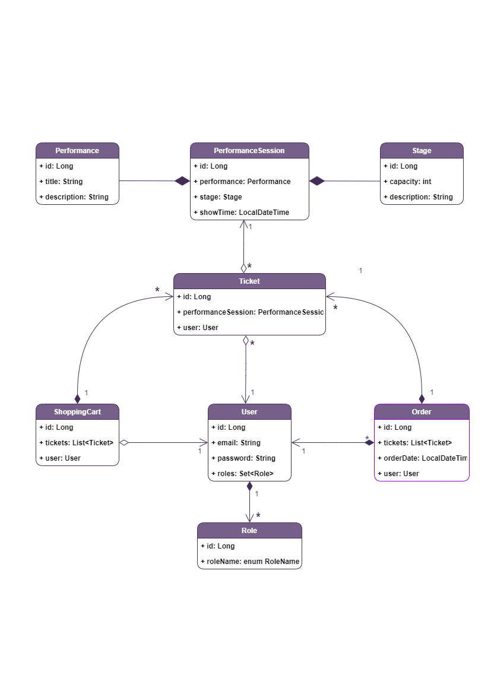

# Opera-tickets-app

----
A prototype of an online store selling opera tickets with 
basic functionality for users and admins written in Java.

In this project used N-tier architecture with DB layer, 
DAO layer, Service layer, Controllers layer. Project was 
developed according to SOLID principles with authorization 
and authentication.

###Project structure

___UML diagram that describes the relationship between the 
entities.___

 Admin: 
- View / add performance
- View / add stage
- Add performance session
- Find performance session by date
- Find user by email

 User:
- View a list of available performances
- View the list of stages
- View order list
- Find performance session by date
- Add performance sessions to shopping cart
- Make an order

 No role:
- Registration
- Authorization

###Technologies stack:

###Running the Project

1. Download and install the [JDK]( https://www.oracle.com/ru/java/technologies/javase-downloads.html).
2. Download and install servlet container ([Apache Tomcat](http://tomcat.apache.org/index.html)).
3. Download and install [MySQL Server](https://dev.mysql.com/downloads/).
4. Download and install [MySQL Workbench](https://www.mysql.com/products/workbench/)
5. Find file _db.properties_ in resources and change the parameters to yours:
    - url: jdbc:mysql://"host name":"port"/"name db"?serverTimezone=UTC
    - username: "username"
    - password: "password"
6. Run the project.

__The admin is created by default__. To log in as an Admin on the website, 
you should log in as admin@gmail.com with the password Admin123. 
If you want to add/change parameters you should do the following steps:
1. open _InjectData_ class in package controllers
2. find method _injectRolesAndUsers()_
3. create new User with the role "admin" or change parameters to yours:
    + admin.setEmail("email")
    + admin.setPassword("password")
